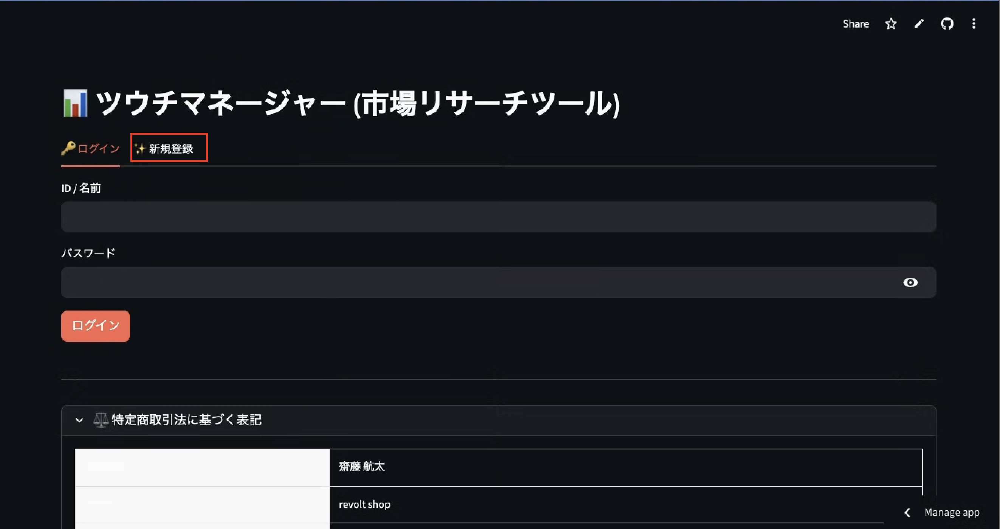
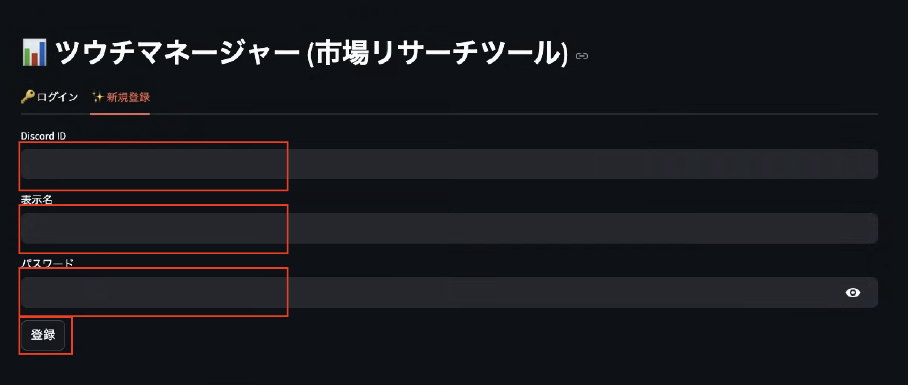
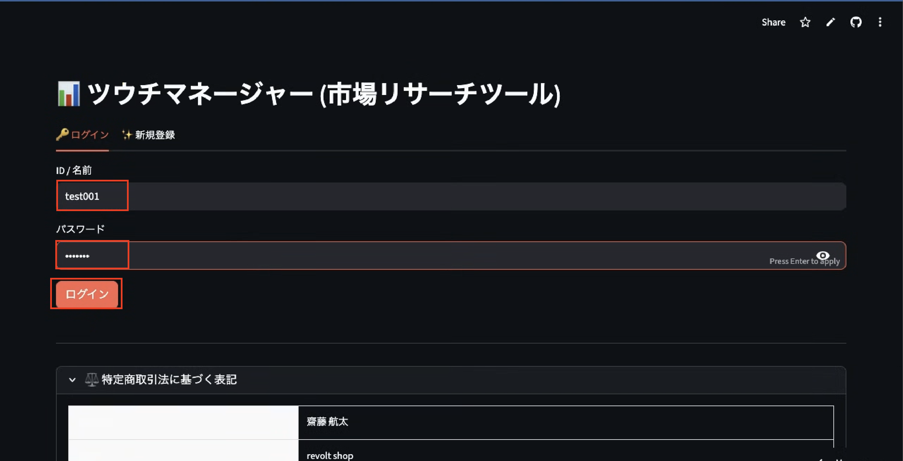
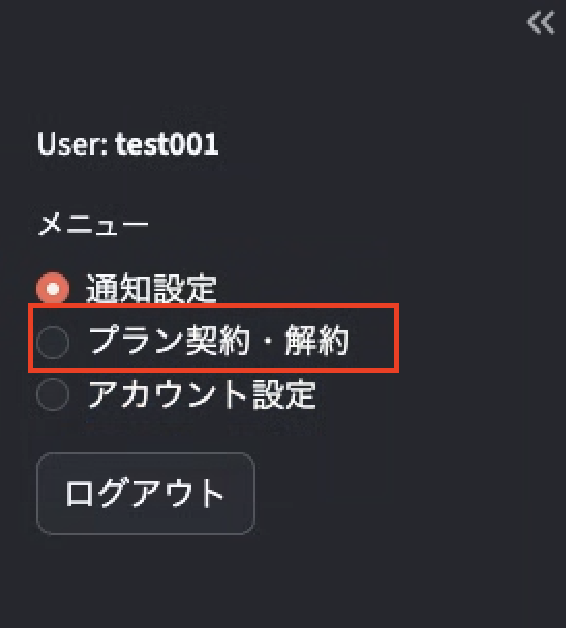
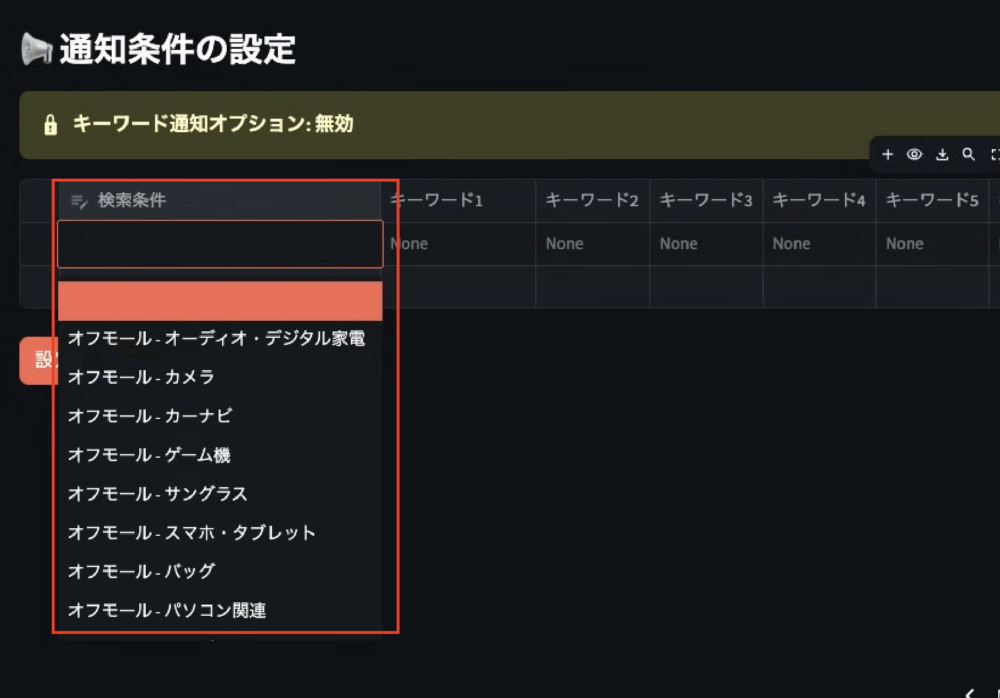

# ツウチマネージャー 設定マニュアル

**市場リサーチツール** — フリマ・オークションサイトの新着商品をDiscordへリアルタイム通知するツールです。

---

## 目次

1. [事前準備：Discord IDの確認](#1-事前準備discord-idの確認)
2. [アカウント登録](#2-アカウント登録)
3. [ログイン](#3-ログイン)
4. [プランの契約](#4-プランの契約)
5. [通知条件の設定](#5-通知条件の設定)

---

## 1. 事前準備：Discord IDの確認

登録にはご自身の **Discord ユーザーID（数字のみ）** が必要です。

**取得手順：**

1. Discordアプリを開く
2. 設定 → 「詳細設定」→「**開発者モード**」をオンにする
3. ご自身のプロフィールを右クリック →「**IDをコピー**」

> ※ IDは `123456789012345678` のような18桁の数字です

---

## 2. アカウント登録

[https://discord-notify-tool.streamlit.app/](https://discord-notify-tool.streamlit.app/) にアクセスし、「✨ 新規登録」タブを選択します。

「新規登録」タブをクリックすると、以下の入力フォームが表示されます。

| 項目 | 入力内容 |
|------|----------|
| **Discord ID** | 手順1で確認した18桁の数字 |
| **表示名** | ツール内で使用するお好きな名前 |
| **パスワード** | 任意のパスワード（6文字以上推奨） |

入力後、「**登録**」ボタンを押してください。

> ⚠️ **登録後に管理者への連絡が必要です**
>
> アカウント登録後、Discordサーバーへの招待および通知チャンネルの有効化作業が必要となります。
> 登録が完了しましたら、**管理者までLINEにてご連絡ください**。
> 管理者が有効化作業を行った後、ご利用いただけるようになります。

---

## 3. ログイン

「🔑 ログイン」タブで登録済みの情報を入力してログインします。

- **ID / 名前**：登録時のDiscord IDまたは表示名
- **パスワード**：登録時のパスワード

「**ログイン**」ボタンを押すとダッシュボードに移動します。

---

## 4. プランの契約

ログイン後、左サイドバーから「**プラン契約・解約**」を選択します。

### プラン一覧

| プラン | 月額 | 対象カテゴリ |
|--------|------|-------------|
| **フルプラン（全て）** | ¥10,000 | アパレル・その他 全カテゴリ |

### オプション

| オプション | 追加料金 | 内容 |
|-----------|----------|------|
| キーワード通知オプション | +¥2,000/月 | 検索条件にキーワードフィルターを追加 |

> ※ キーワードオプションなしの場合、選択したカテゴリの全商品が通知されます

プランとオプションを選択後、「**お支払い画面へ進む**」をクリックしてStripeの決済ページで支払いを完了してください。

---

## 5. 通知条件の設定

契約完了後、サイドバーの「**通知設定**」メニューから通知条件を設定します。

### 検索条件の追加方法

1. テーブル左端の「**検索条件**」列をクリック
2. ドロップダウンから通知を受け取りたいサイト・カテゴリを選択
3. （オプション契約者のみ）キーワード列にフィルタワードを入力
4. 「**設定を保存**」ボタンで保存

### キーワードの入力ルール（オプション契約者向け）

| 条件 | 入力方法 | 例 |
|------|----------|----|
| **AND条件**（〇〇 かつ △△） | 同じ枠内にスペースで区切って入力 | `ナイキ 黒` |
| **OR条件**（〇〇 または △△） | 別の枠（横の列）に入力 | キーワード1: `ナイキ` ／ キーワード2: `アディダス` |

**例：** キーワード1に「ナイキ 黒」、キーワード2に「アディダス」と入力すると、「ナイキの黒い商品」または「アディダスの商品」が通知されます。

枠を増やしたい場合は「➕ キーワード枠の列を追加する」ボタンを押してください（最大30枠）。

---

## 6. 料金・サブスクリプションの仕組み

### 支払いのタイミング

- **初回支払い**: プラン契約時に即時決済されます
- **毎月の更新**: 初回支払い日と同じ日付に自動で引き落とされます  
  （例：5月15日に契約 → 毎月15日に自動更新）
- 決済はクレジットカードのみ対応です（Stripe経由）

### 解約した場合

- 「プラン契約・解約」→「プランを解約する」から解約手続きができます
- 解約後も**当月の契約期間終了日までは引き続き利用可能**です
- 期間終了後は自動でアクセスが制限されます（再ログイン時に反映）
- 日割り返金には対応しておりません

### ご注意

- カードの有効期限切れや残高不足による引き落とし失敗の場合、管理者が手動で対応します。引き落とし失敗が続くとサービスを停止する場合があります
- プランの途中変更（アップグレード・ダウングレード）は現在対応しておりません。一度解約後、再契約をお願いします

---

## メニュー一覧

| メニュー | 機能 |
|----------|------|
| 通知設定 | 通知を受け取るサイト・カテゴリ・キーワードの管理 |
| プラン契約・解約 | サブスクリプションの契約・解約 |
| アカウント設定 | アカウント情報の変更 |

ログアウトはサイドバー下部の「**ログアウト**」ボタンから行えます。

---

## よくある質問

**Q. Discordに通知チャンネルが届かない**  
A. 対象のDiscordサーバーに参加しているか確認してください。参加後に登録を行ってください。

**Q. 解約したい**  
A. 「プラン契約・解約」メニューの「プランを解約する」から手続きできます。解約後も契約期間終了まで利用可能です。

**Q. キーワードを設定したのに通知が来ない**  
A. キーワード通知オプションの契約状況を確認してください。未契約の場合はキーワード列が無効（グレーアウト）になっています。

---

> 運営：revolt shop　お問い合わせ：koutaiwi@gmail.com
